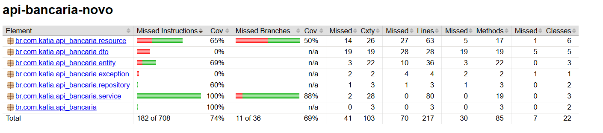

````md
# API Bancária - Quarkus

Projeto acadêmico desenvolvido para a disciplina de Testes de Software, utilizando Quarkus para simular operações de um banco digital.

---

# Tecnologias Utilizadas

- Java 21
- Quarkus 3
- Hibernate ORM Panache
- RESTEasy Reactive
- H2 Database
- PostgreSQL Driver
- JUnit 5
- Mockito
- RestAssured
- Jacoco

---

# Funcionalidades

A API permite:

- Cadastro de clientes
- Criação de contas bancárias
- Consulta de contas
- Consulta de saldo
- Depósito
- Saque
- Transferência entre contas

---

# Estrutura do Projeto

```text
src
 ├── main
 │    ├── java
 │    │     └── br.com.katia.api_bancaria
 │    │            ├── dto
 │    │            ├── entity
 │    │            ├── exception
 │    │            ├── repository
 │    │            ├── resource
 │    │            └── service
 │    │
 │    └── resources
 │          ├── application.properties
 │          └── import.sql
 │
 └── test
      └── java
            └── br.com.katia.api_bancaria
                   ├── integracao
                   ├── resource
                   ├── service
                   └── testutil
````

---

# Executar o Projeto

## Modo desenvolvimento

```bash
mvn quarkus:dev
```

A API ficará disponível em:

```text
http://localhost:8080
```

---

# Swagger / OpenAPI

Documentação automática disponível em:

```text
http://localhost:8080/q/swagger-ui
```

---

# Executar Testes

```bash
mvn clean test
```

---

# Build Completo

```bash
mvn clean install
```

---

# Testes Implementados

## Testes Unitários

### ContaServiceTest

* depósito com sucesso
* saque com sucesso
* transferência com sucesso
* conta inexistente
* saldo insuficiente
* valor inválido
* cálculo de saldo

### ClienteServiceTest

* salvar cliente
* buscar cliente
* listar clientes

### TransacaoServiceTest

* depósito
* saque
* transferência
* validações de erro

---

## Testes de Integração

### ContaResourceTest

* criar conta
* listar contas
* buscar conta
* depósito
* saque
* saque sem saldo
* transferência
* consulta de saldo

### ClienteResourceTest

* criar cliente
* buscar cliente por id

---

# Cobertura de Testes - Jacoco

Resultado final da cobertura:

| Tipo     | Cobertura |
| -------- | --------- |
| Linhas   | 74%       |
| Branches | 69%       |




Relatório disponível em:

```text
target/jacoco-report/index.html
```

---

# Banco de Dados para Testes

Os testes utilizam:

```text
H2 Database em memória
```

Garantindo:

* isolamento entre testes
* independência de execução
* rapidez na execução da suíte

---

# Padrões Utilizados nos Testes

* AAA (Arrange / Act / Assert)
* assertThrows
* Mockito verify
* RestAssured
* @BeforeEach para limpeza do banco
* testes independentes

---

# Autor

Katia Kuhn

Projeto desenvolvido para fins acadêmicos.

```
```
